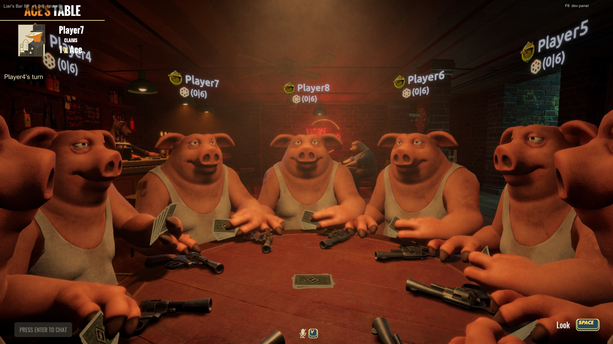
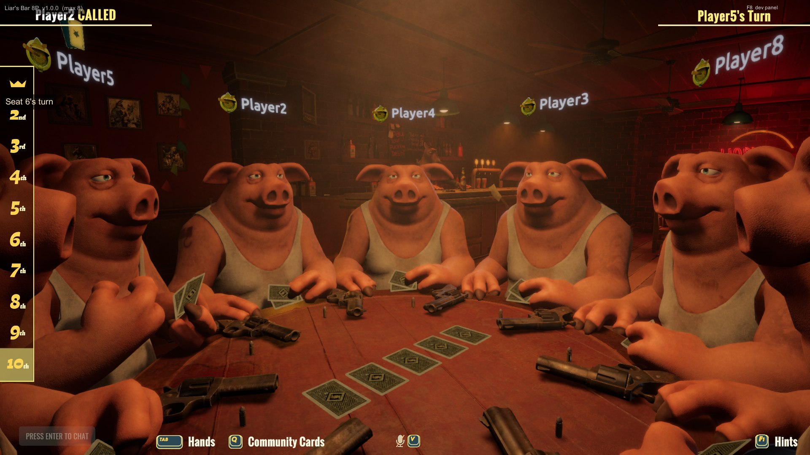
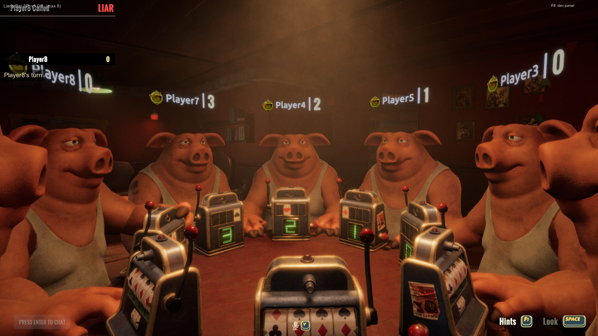
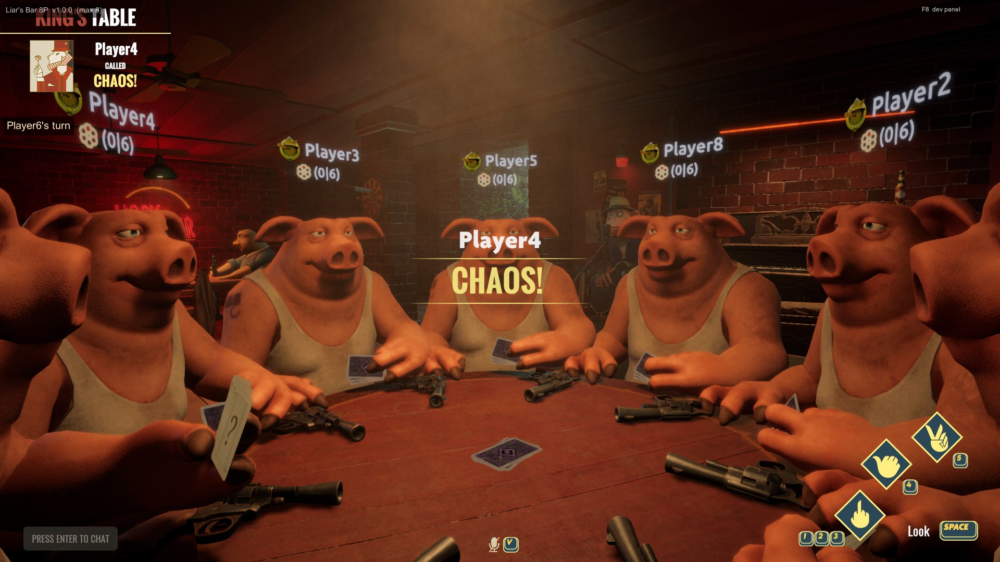
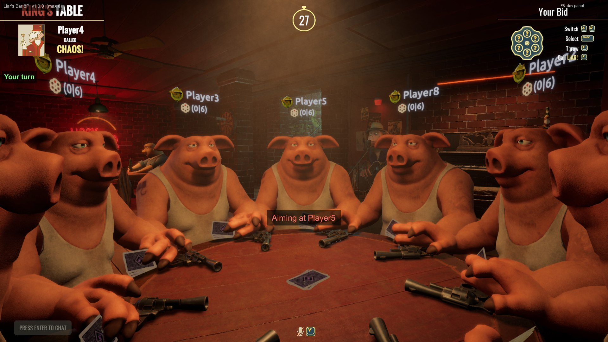

# Liar's Bar — 8 Player Mod

> **Written by an AI.** Every line of this mod was produced by Claude, directed by one person,
> as a for-fun experiment. Nothing here shipped on the strength of "it should work" — see
> [How this was made](#how-this-was-made) for what was actually tested, and where the limits
> still are.

**Four chairs became eight.** Same bar, same cards, same revolver — twice the table.

Liar's Bar is at its best when somebody is lying to your face. This puts seven of them there
instead of three.

Built with [BepInEx 6 (IL2CPP)](https://github.com/BepInEx/BepInEx) + Harmony. **No game files
are modified on disk** — everything is patched at runtime, and Steam's *Verify integrity of
game files* undoes the install completely.

**Everyone playing together must install this and run the same version.** A vanilla client in a
modded lobby will desync. The version you are running is drawn in the top-left corner in game,
and every player is warned when somebody's build differs.

---

## Eight at the table



Eight players at a table built for four, evenly spaced, each with their name above them and
whose turn it is in the corner.

The lobby puts the extra players on a second row, pulls the camera back so everyone is in
frame, and lifts each name plate above the player it belongs to — the plates hang low beside a
podium in the shot the lobby was built for, which from further back would leave them around
everybody's knees:


*(Seven in, waiting on the eighth — the lobby only holds a full table for a few seconds before
the match starts.)*

It is not only Liar's Deck. The seat ring, the caps, the turn order and the deal are fixed for
every mode the lobby can reach.

**Liar's Dice** — eight players bidding, and a reveal that now survives a liar call:


**Liar's Texas** — eight hands, community cards, and the placement ladder down the side:



**Liar's Spin** — eight machines, eight scores:



**The Chaos deck** — where a chaos card stops the round and everyone picks somebody to shoot:



And this is the fix this release exists for. Before it, at eight players, the revolver could
only be pointed at three fixed chairs — and if you were sitting in seat four or later you could
not aim at anybody at all. Now every seat can choose any other, and because the game only has
three aiming animations and never turns anyone to face a particular chair, the mod tells you
who you have actually picked:



*(Every screenshot is from the test harness, where the players are named Player1–Player8.)*

---

## What was tested

Every mode a player can choose from the lobby arrows, at every table size from one to eight,
in all four bars. **Sixty-five matches, eight and a half hours**, each one a real table of that
many separate copies of the game with its own network connection — seating measured on *every*
machine rather than only the host's.

| Table | 8 | 7 | 6 | 5 | 4 | 3 | 2 | 1 |
|---|:-:|:-:|:-:|:-:|:-:|:-:|:-:|:-:|
| **Liar's Deck — Basic** | ✅ | ✅ | ✅ | ✅ | ✅ | ✅ | ✅ | lobby |
| **Liar's Deck — Devil** | ✅ | ✅ | ✅ | ✅ | ✅ | ✅ | ✅ | lobby |
| **Chaos Deck** | ✅ | ✅ | ✅ | ✅ | ✅ | ✅ | ✅ | lobby |
| **Liar's Dice** (both) | ✅ | ✅ | ✅ | ✅ | ✅ | ✅ | ✅ | lobby |
| **Liar's Texas** | ✅ | ✅ | ✅ | ✅ | ✅ | ✅ | ✅ | lobby |
| **Liar's Spin** | ✅ | ✅ | ✅ | ✅ | ✅ | ✅ | ✅ | lobby |

✅ means everyone seated on the ring, everyone dealt what the mode deals, the turn reaching
every seat, and the mode's own mechanic seen firing — not merely "it started".

A table of one is a lobby: it forms, holds and reports nothing wrong, and no match begins.

**Seats, measured on every machine:**

| Players | Gap between seats | Furthest anyone sat from their own chair |
|---|---|---|
| 8 | 44.9–45.1° | 0.00 m |
| 7 | 51.2–51.7° | 0.11 m |
| 6 | 59.7–60.3° | 0.01 m |
| 5 | 71.7–72.2° | 0.01 m |

---

## What still is not true

**Eight people on eight different machines has never happened.** Every table above is eight
copies of the game talking to each other on one PC. That exercises every message that crosses
between machines, and it is not the same as eight of you in a Steam lobby. The largest real
game so far was five people on five PCs. Treat the first real eight-player match as the test it
is, and keep `BepInEx/LogOutput.log` if anything looks wrong.

**Two faults belong to the game, not the mod, and are still there.** The Chaos deck makes every
client log a handful of `NullReferenceException`s handling two of the game's own remote calls,
and Liar's Spin logs a few per round. Both happen at four players as well — this mod did not
introduce them and does not fix them. What it does is catch the first kind so Mirror does not
drop the connection, which is what used to end the session for everybody.

**Liar's Texas throws once as a round sets up** above four players. The round plays on and
nothing visibly misbehaves; the cause is not isolated.

`docs/PLAYER-LIMITS.md` maps every hard-coded four in the game, what it broke, and what was
done about it — including the two found this release.

---

## How this was made

**This mod was written by an AI** — Claude, working from the game's decompiled code and directed
by one person. It began as a for-fun experiment in how far that could be taken, and it is
offered in that spirit rather than as a commercial product.

That is a reason to read the limits above. It is not a reason to expect something flaky.
Everything here was checked by running the game and reading what it did, not by reasoning about
what it ought to do — and the difference matters, because this release exists because of two
bugs that reasoning had missed for months:

- In the Chaos deck at eight players, **half the table could not be shot at.** The revolver
  could only be pointed at three fixed chairs, and seats four to seven could not aim at anybody
  at all. Nothing had noticed because no test had ever thrown a chaos card *and then taken the
  shot* — the logs recorded "chaos aim resolved", which was true, and meant only that it had
  resolved the way it resolves when nobody is playing.
- **Liar's Dice stopped dead on the first liar call** above four players, in every release of
  this mod, and the only way out was to quit. Nothing had noticed because nothing in the test
  rig knew how to play Liar's Dice.

Both are fixed. What changed to find them is that the test harness now plays every mode through
the same methods a keypress reaches, measures the things it used to assume, and refuses to
report a run in which it was not actually driving anybody.

Where something is untested, or is known to be wrong and left alone, this project says so
instead of rounding it up. See **What still is not true** above, and `STATUS.md` for the long
version.

No game files are changed on disk. Nothing phones home. The mod reads and writes only inside
your Liar's Bar folder.

---

## What it changes

Raising the number is the easy part; none of the rest follows from it. The game assumes four
players in around thirty separate places, and each had to be found and dealt with on its own
terms.

| | |
|---|---|
| **Eight at the table** | The chairs are re-spaced round whatever table the bar has, evenly, at any size from two to eight. Nobody bunches up and nobody sits inside the furniture. |
| **Eight in the lobby** | Four extra podiums, a second row, the camera pulled back so everyone is in frame, and each name plate lifted above the player it belongs to. |
| **The turn reaches everyone** | Six separate places wrap the seat number at three. All six are rewritten, including two that only matter when somebody dies or drops mid-round. |
| **Everyone is dealt** | Nine routines allocate room for exactly four hands. Every one is widened, and the deck grows with the table so nobody is short. |
| **You can shoot anyone** | In the Chaos deck the revolver could only be pointed at three fixed chairs. Now every seat can choose any other, and the mod names your target on screen — three canned aiming poses cannot identify one of seven people. |
| **It says what it did** | The version is drawn in the corner, everyone is warned if somebody's build differs, and the log names the exact networked call behind any failure instead of leaving you guessing. |

---

## Install

Download **`Install-LiarsBar8P.bat`** from the
[latest release](../../releases/latest) and run it.

It finds Liar's Bar through Steam automatically, removes any previous copy of the mod, and
installs the current one. It asks for administrator permission because the game lives under
`Program Files`.

**Keep the file — running it again is how you update.** It asks GitHub for the newest release
every time it runs, so it never goes stale.

It is a plain text file — open it in Notepad first if you want to see what it does.

<details>
<summary>Manual install instead</summary>

1. Download `LiarsBar-8P.zip` from the [latest release](../../releases/latest).
2. Extract it somewhere.
3. Run `install.bat` from inside the extracted folder.

Or fully by hand: copy the zip's contents into your Liar's Bar folder so that `winhttp.dll`
and `BepInEx/` sit next to `Liar's Bar.exe`.
</details>

**The first launch after installing is slow** — up to a few minutes while BepInEx prepares
the game. This happens once. Let it reach the main menu.

To confirm it worked, look at the top-left corner in game, or open `BepInEx/LogOutput.log`
and look for:

```
=== Liar's Bar 8P loaded ===
[cap] maxConnections 4 -> 8
[turn] GiveTurn: wraps at seat 3 -> 7
[dealarray] DeckGamePlayManager.GiveCardsVisualRoutine: the deal now walks 8 seats rather than 4
```

That last line should appear **seven times**, once per mode — if one of them says it was left
as shipped, that mode will deal to the first four seats and go quiet.

## Configure

`BepInEx/config/liarsbar.eightplayers.cfg`, created on first run. The installer replaces it on
every install, so a setting changed by hand does not survive an update — that is deliberate: a
stale setting once silently disabled a fix for a whole session.

| Setting | Default | Meaning |
|---|---|---|
| `MaxPlayers` | `8` | Lobby size. **Must match across all players.** |
| `VerboseDiagnostics` | `true` | Log seat, podium and deck counts. Leave on — it is what makes a bad round diagnosable. |
| `DeveloperMode` | `false` | Test tools: bots, an F8 panel, and a running account of everything. Leave off for normal play. |
| `SelfTest*` | `false` | Developer only. Leave off. |

## Testers wanted

The one thing this mod cannot test on its own is **a full lobby of people on their own PCs**.
Everything short of that has been done; eight *people* on eight *machines* has not. If you
play a game with it — any size — a log is genuinely useful, whether it went well or badly.

Especially wanted:

- **Eight players on eight machines.** Nobody has done it outside a test rig.
- **A chaos card at a full table.** Every seat can now choose any other, and the choice is
  named on screen while you make it. It has been measured from every chair; it has not been
  played by people who did not know what it was supposed to do.
- **Anything that looks wrong** — somebody in the wrong seat, a hand that never arrives, a
  name plate in the wrong place, a round that stops.

### Sending a log

There is one file, and **it is overwritten every time the game starts**, so copy it out before
launching again.

1. Play the game.
2. Quit to the desktop.
3. Open the game folder — in Steam, right-click **Liar's Bar → Manage → Browse local files**.
4. Copy **`BepInEx\LogOutput.log`** somewhere safe.
5. Open an issue at
   [github.com/dracbat/liarsbar-8p/issues](https://github.com/dracbat/liarsbar-8p/issues) and
   attach it.

Tell us three things with it: **how many players**, **which mode**, and **what looked wrong**.
The host's log is the most useful one, but a log from any player helps.

> **Read it before you post it.** The log records the Steam names of everyone in your lobby,
> because that is what the game calls them. It contains no passwords, keys or addresses — but
> it does have your friends' names in it, so treat it the way you would a screenshot of your
> friends list.

What the log will already have told us before you say a word: which of the mod's fixes
applied, how many people were at the table, where everyone was sitting, what each seat was
dealt, and the exact name of any networked call that failed.

## Uninstall

Run `uninstall.bat` from the zip, or delete `winhttp.dll`, `doorstop_config.ini`,
`.doorstop_version`, `changelog.txt`, and the `BepInEx/` and `dotnet/` folders.

Since no game files are ever modified, Steam's **Verify integrity of game files** also
restores everything.

## Building from source

Requires the .NET SDK and a local install of the game with BepInEx already set up (the project
references the interop assemblies BepInEx generates on first launch).

```
cd src/LiarsBar8P
dotnet build -c Release
```

`deploy.ps1` builds and copies the plugin into the game. `tools/sweep.ps1` runs the whole test
matrix — every mode, every table size, every bar. `package.ps1` produces the distributable zip
and refuses to run if any file about to ship carries the build account's name. `release.ps1`
does the whole release in one command.

## Notes

- `docs/PLAYER-LIMITS.md` — every hard-coded four in the game, and what was done about it
- `CHANGELOG.md` — what changed in each version, and why
- `STATUS.md` — what has been tested, and what has not
- `NOTES.md` — architecture and class map

No game assets or binaries are included in this repository.

## Licence

MIT, covering this mod's own source only. Liar's Bar is the property of Curve Animation;
BepInEx is redistributed under LGPL-2.1. You must own the game.
