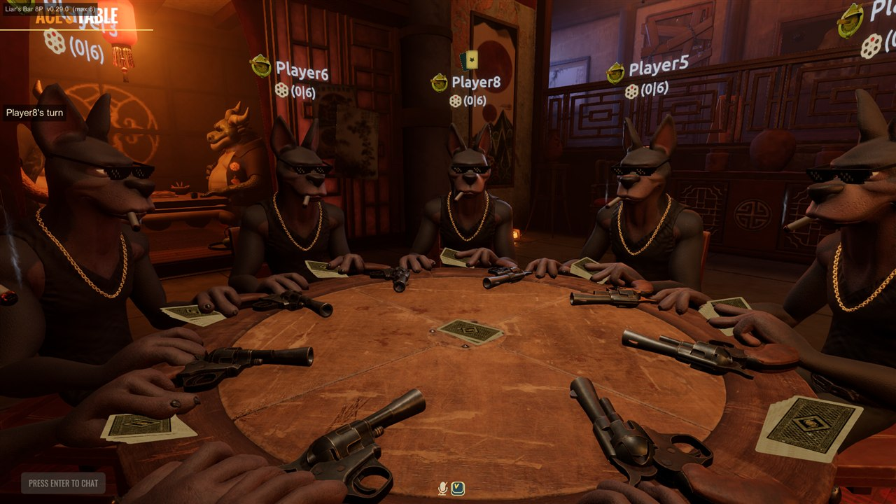
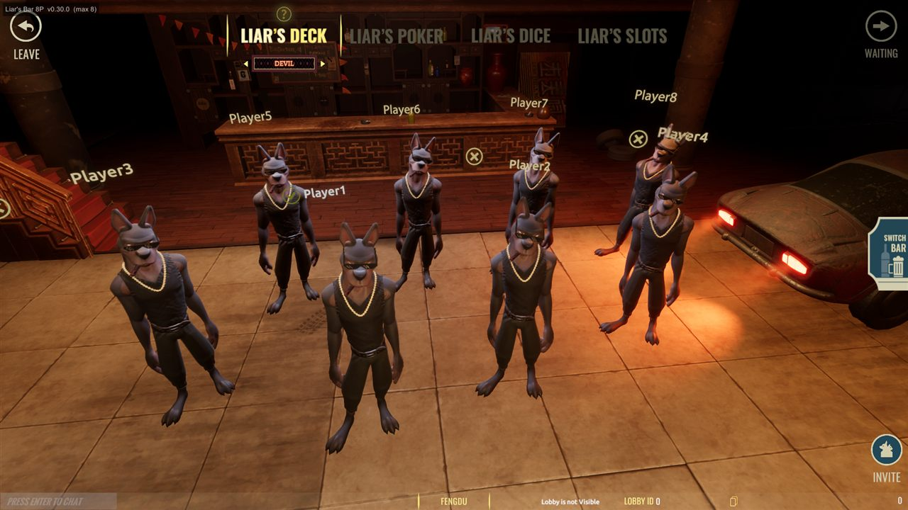
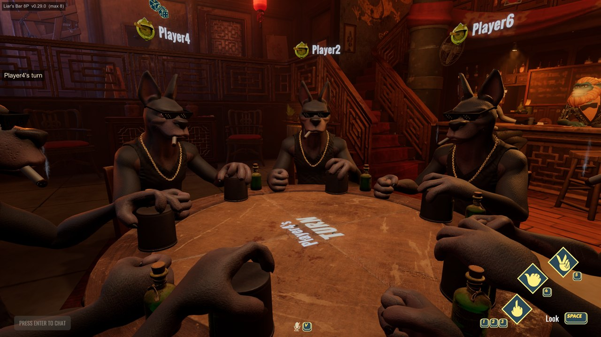
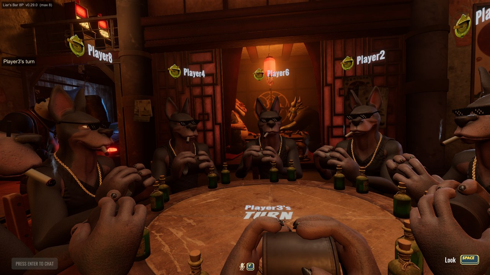
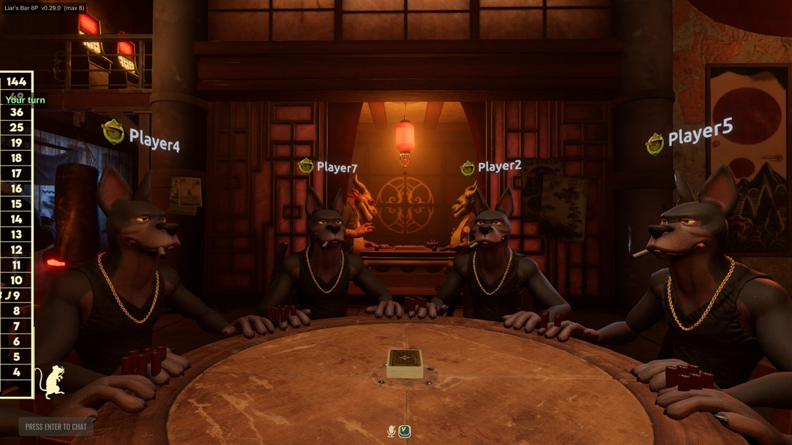

# Liar's Bar — 8 Player Mod

Raises Liar's Bar from 4 players to 8 (configurable 2–16).

Built with [BepInEx 6 (IL2CPP)](https://github.com/BepInEx/BepInEx) + Harmony. No game
files are modified on disk — everything is patched at runtime, and Steam's *Verify
integrity of game files* undoes the install completely.

**Everyone playing together must install this and run the same version.** A vanilla
client in a modded lobby will desync. The version you are running is drawn in the
top-left corner in game, and every player is warned when someone's build differs.

---

## What it looks like

Eight players at a table built for four, sharing it evenly:



The lobby puts the extra players in a second row, pulls the camera back so everyone is in
frame, and lifts each name plate above the player it belongs to — the plates hang low beside
a podium in the shot the lobby was built for, which from further back leaves them around
everybody's knees:



The table is divided by however many are actually playing, so five, six or seven sit
evenly too rather than bunching along one side — here six in Liar's Dice, 60° apart:



It is not only Liar's Deck. The seat ring, the caps and the turn order are shared across
the modes — Liar's Dice at eight, and Liar's Poker at seven:





*(Every screenshot is from the loopback test harness, where the players are named
Player1–Player8.)*

---

## What works

Every row below was played at **five, six, seven and eight** — a real table of that many
separate copies of the game, each with its own Mirror connection, seats measured on every
machine rather than only the host's.

| Table | Status |
|---|---|
| **Liar's Deck — Basic** | ✅ 5, 6, 7, 8. Everyone seated, dealt, and taking turns in order |
| **Liar's Deck — Devil** | ✅ 5, 6, 7, 8, and a devil's deal seen to fire at seven |
| **Chaos Deck** | ✅ 5, 6, 7, 8, with a chaos card thrown and resolved at every size |
| **Liar's Dice** | ✅ seated and playing at 5, 6, 7, 8 · ⚠️ the turn ring is unconfirmed at 7 and 8 |
| **Liar's Texas** | ✅ eight players seated, dealt and taking turns |
| **Liar's Poker** | ✅ five players seated, dealt and taking turns |
| **Liar's Spin** | ❔ not yet started from the test harness — untested, not known broken |
| Steam lobby of 8 | ✅ Steam's own API reports the raised member limit |
| Lobby podiums and name plates for 8 | ✅ Each name above its own player, at every size |

**What has still never happened is eight people on eight different machines, over Steam.**
Every table above is eight copies of the game talking to each other on one PC, which
exercises every message that crosses between machines but is not the same as eight of you in
a lobby. Treat the first real eight-player game as the test it is, and keep
`BepInEx/LogOutput.log` if something looks wrong — it now names the exact call behind a
failure rather than leaving you guessing.

A note on the Chaos deck: it makes every client log a `NullReferenceException` handling two of
the game's own remote calls. That is not this mod — **the identical faults appear at four
players**, which is the game as shipped. They used to end the session for everybody; the mod
now logs them and plays on.

`docs/PLAYER-LIMITS.md` maps every place the game assumes four players, and what was
done about each.

---

## Install

Download **`Install-LiarsBar8P.bat`** from the
[latest release](../../releases/latest) and run it.

It finds Liar's Bar through Steam automatically, removes any previous copy of the mod,
and installs the current one. It asks for administrator permission because the game
lives under `Program Files`.

**Keep the file — running it again is how you update.** It asks GitHub for the newest
release every time it runs, so it never goes stale and there is no need to download it
a second time.

It is a plain text file — open it in Notepad first if you want to see what it does.

<details>
<summary>Manual install instead</summary>

1. Download `LiarsBar-8P.zip` from the [latest release](../../releases/latest).
2. Extract it somewhere.
3. Run `install.bat` from inside the extracted folder.

Or fully by hand: copy the zip's contents into your Liar's Bar folder so that
`winhttp.dll` and `BepInEx/` sit next to `Liar's Bar.exe`.
</details>

**The first launch after installing is slow** — up to a few minutes while BepInEx
prepares the game. This happens once. Let it reach the main menu.

To confirm it worked, look at the top-left corner in game, or open
`BepInEx/LogOutput.log` and look for:

```
=== Liar's Bar 8P loaded ===
[cap] maxConnections 4 -> 8
[transport] server maxConnections 4 -> 8
[turn] GiveTurn: wraps at seat 3 -> 7
[dealarray] DeckGamePlayManager.GiveCardsVisualRoutine: the deal now walks 8 seats rather than 4
```

That last line should appear **seven times**, once per mode — if one of them says it was
left as shipped, that mode will deal to the first four seats and go quiet.

## Configure

`BepInEx/config/liarsbar.eightplayers.cfg`, created on first run. The installer replaces
it on every install, so a setting changed by hand does not survive an update — that is
deliberate: a stale setting once silently disabled a fix for a whole session.

| Setting | Default | Meaning |
|---|---|---|
| `MaxPlayers` | `8` | Lobby size. **Must match across all players.** |
| `VerboseDiagnostics` | `true` | Log seat, podium and deck counts. Leave on — it is what makes a bad round diagnosable. |
| `SelfTestAutoHostLobby` | `false` | Developer only. Leave off. |
| `SelfTestForceSoloStart` | `false` | Developer only. Leave off. |
| `SelfTestDeckSizePatch` | `false` | Developer only. Leave off. |

## Uninstall

Run `uninstall.bat` from the zip, or delete `winhttp.dll`, `doorstop_config.ini`,
`.doorstop_version`, `changelog.txt`, and the `BepInEx/` and `dotnet/` folders.

Since no game files are ever modified, Steam's **Verify integrity of game files**
also restores everything.

## Building from source

Requires the .NET SDK and a local install of the game with BepInEx already set up
(the project references the interop assemblies BepInEx generates on first launch).

```
cd src/LiarsBar8P
dotnet build -c Release
```

`deploy.ps1` builds and copies the plugin into the game. `package.ps1` produces the
distributable zip and refuses to run if any file about to ship carries the build
account's name. `release.ps1` does the whole release in one command.

## Notes

- `docs/PLAYER-LIMITS.md` — every hard-coded four in the game, and what was done about it
- `CHANGELOG.md` — what changed in each version, and why
- `NOTES.md` — architecture and class map

No game assets or binaries are included in this repository.

## Licence

MIT, covering this mod's own source only. Liar's Bar is the property of Curve
Animation; BepInEx is redistributed under LGPL-2.1. You must own the game.
